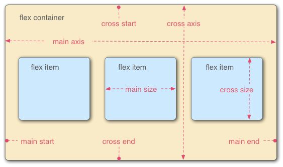
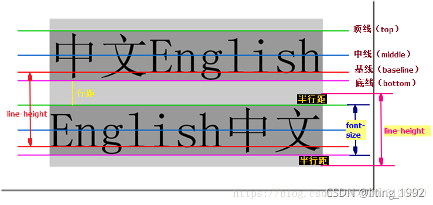

<style type="text/css">
    h1 { counter-reset: h2counter; }
    h2 { counter-reset: h3counter; }
    h3 { counter-reset: h4counter; }
    h4 { counter-reset: h5counter; }
    h5 { counter-reset: h6counter; }
    h6 { }
    h2::before {
      counter-increment: h2counter;
      content: counter(h2counter) ".\0000a0\0000a0";
    }
    h3::before {
      counter-increment: h3counter;
      content: counter(h2counter) "."
                counter(h3counter) ".\0000a0\0000a0";
    }
    h4::before {
      counter-increment: h4counter;
      content: counter(h2counter) "."
                counter(h3counter) "."
                counter(h4counter) ".\0000a0\0000a0";
    }
    h5::before {
      counter-increment: h5counter;
      content: counter(h2counter) "."
                counter(h3counter) "."
                counter(h4counter) "."
                counter(h5counter) ".\0000a0\0000a0";
    }
    h6::before {
      counter-increment: h6counter;
      content: counter(h2counter) "."
                counter(h3counter) "."
                counter(h4counter) "."
                counter(h5counter) "."
                counter(h6counter) ".\0000a0\0000a0";
    }
    .italic {
        font-style: italic;
    }
    .normal {
        font-style: normal;
    }
    .oblique {
        font-style: oblique;
    }
    .text_decoration {
        text-decoration: underline red wavy;
    }
    .text_shadow {
        font-size: 5em;
        text-shadow:
            -1px -1px 1px #aaa,
            0px 4px 1px rgba(0, 0, 0, 0.5),
            4px 4px 5px rgba(0, 0, 0, 0.7),
            0px 0px 7px rgba(0, 0, 0, 0.4);
    }
    img {
      display: block;
      margin: 0 auto;
      align: center;
    }
</style>
# CSS 语法基础

## 样式
### 选择器

#### 类型、类和ID选择器
```css
element.<class1>.<class2>#id {
    ...
}
```

#### 属性选择器
```css
element[attr] { /* 选择具有 attr 属性的所有元素 */
    ...
}
element[attr="value"] { /* 选择具有 attr 属性且值等于 "value" 的所有元素 */
    ...
}
element[attr="value" i] { /* 选择具有 attr 属性且值等于 "value" （不区分大小写）的所有元素 */
    ...
}
element[attr~="value"] {  /* 选择具有 attr 属性且属性列表中存在值等于 "value" 的所有元素 */
    ...
}
element[attr|="value"] { /* 选择具有 attr 属性且属性值等于 "value" 或以 "value-" 开头的所有元素 */
    ...
}
element[attr^="value"] { /* 选择具有 attr 属性且属性值以 "value" 开头的所有元素 */
    ...
}
element[attr$="value"] { /* 选择具有 attr 属性且属性值以 "value" 结尾的所有元素 */
    ...
}
element[attr*="value"] { /* 选择具有 attr 属性且属性值中任意位置包含 "value" 的所有元素 */
    ...
}
```

#### 伪类和伪元素选择器

[伪类和伪元素速查表](https://developer.mozilla.org/zh-CN/docs/Learn/CSS/Building_blocks/Selectors/Pseudo-classes_and_pseudo-elements#%E5%8F%82%E8%80%83%E8%8A%82)
伪类描述的是元素的一种状态
```css
element:hover { /* 选择所有处于 hover 状态的元素 */
    ...
}
element:first-child { /* 选择作为第一个子元素的元素 */
    ...
}
```
**e.g. nth-child伪类的用法**
```css
element:nth-child(2n) { /* 选择位于偶数位置的element元素 */
    ...
}
element.class:nth-child(2n+1) { /* 选择位于奇数位置的且拥有class的element元素 */
    ...
}
element:nth-child(2n+1 of .class) { /* 选择拥有class的element元素中奇数位置的那些 */
    ...
}
```
伪元素描述的是元素的部分
```css
element::first-line { /* 选择所有元素的首行 */
    ...
}
element::first-letter { /* 选择所有元素的首字母 */
    ...
}
element::before { /* 元素中所有内容之前 */
    content: "..."; /* 这里可以设置插入内容 */
}
element::after { /* 元素中所有内容之后 */
    content: "..."; /* 这里可以设置插入内容 */
}
```

#### 关系选择器

```css
element1 element2 { /* 选择所有 element2 元素，且 element2 是 element1 的后代 */
    ...
}

element1 > element2 { /* 选择所有 element2 元素，且 element2 是 element1 的直接子元素 */
    ...
}

element1 + element2 { /* 选择所有 element2 元素，且 element2 是 element1 的下一个兄弟元素 */
    ...
}

element1 ~ element2 { /* 选择所有 element2 元素，且 element2 是 element1 的后续兄弟元素 */
    ...
}
```

### 层叠层

层叠层是CSS中用于区分样式来源的概念。有多种创建姿势
```css
@layer theme，layout，utilities; /* 创建三个层叠层, 但并没有添加样式 */

@layer layout { /* 创建一个名为layout的层叠层 */
  main {
    display: grid;
  }
}

@layer { /* 创建一个匿名层叠层 */
  body {
    margin: 0;
  }
}

@media (min-width: 600px) { /* 创建一个基于媒体查询的条件层叠层*/
  @layer layout {
    main {
      grid-template-columns: repeat(3, 1fr);
    }
  }
}

/* 将外部样式表导入名为components的层叠层 */
@import url("components-lib.css") layer(components); 
/* 将外部样式表导入components中名为dialog的嵌套层 */
@import url("dialog.css") layer(components.dialog); 
/* 将外部样式表导入一个匿名的层叠层 */
@import url("marketing.css") layer();
/* 将外部样式表导入一个条件层叠层 */
@import url("ruby-narrow.css") layer(international) supports(display: ruby) and (width < 32rem);

/* 嵌套层叠层 */
@layer layout {
  @layer header {
    nav {
      display: flex;
    }
  }
}
```
如果在层叠层创建语句之前，该层叠层已经存在，那么本语句定义的样式会被添加到该层中去。

### 样式的优先级

1. **相关声明**：找到所有具有匹配每个元素的选择器的声明代码块。
2. **重要性**：根据规则是普通还是重要对规则进行排序。重要的样式是指设置了 !important 标志的样式。
3. **来源**：在两个按重要性划分的分组内，按作者、用户或用户代理这几个来源对规则进行排序。
    至此，我们将样式重要性从小到大分为八个分组：
    - 用户代理普通样式
    - 用户普通样式
    - 作者普通样式
    - 正在动画的样式
    - 作者重要样式
    - 用户重要样式
    - 用户代理重要样式
    - 正在过渡的样式
4. **层**：在六个按重要性和来源划分的分组内，按层叠层进行排序。普通声明的层顺序是从创建的第一个到最后一个，然后是未分层的普通样式。对于重要的样式，这个顺序是反转的，但保持未分层的重要样式优先权最低。
    考虑内联样式，对于同一来源的样式，从小到大的排序是：
    - earlier Layer 普通样式
    - later Layer 普通样式
    - 未分层普通样式
    - 内联普通样式
    - 动画样式
    - 未分层重要样式
    - later Layer 重要样式
    - earlier Layer 重要样式
    - 内联重要样式
    - 过渡样式
5. **优先级**：对于来源层中优先权相同的竞争样式，按优先级对声明进行排序。
    样式优先级是由选择器的类型决定的。从上到下根据数量记分，打平进入下一个级别。
    - 内联样式
    - ID 选择器
    - 类、伪类和属性选择器
    - 元素和伪元素选择器

    > 否定（:not()）和任意匹配（:is()）伪类本身对优先级没有影响，但它们的参数则会带来影响。参数中，对优先级算法有贡献的参数的优先级的最大值将作为该伪类选择器的优先级。
    > 通用选择器（*）、组合符（+、>、~、' '）和调整优先级的选择器（:where()）不会影响优先级。
6. **出现顺序**：当两个来源层的优先权相同的选择器具有相同的优先级时，最后声明的获胜。

## CSS 布局

### 盒子模型

#### 盒子的展示方式（display）

外部布局
- **block**：块级元素，默认宽度为父元素的100%，高度由内容决定，可以设置宽高，margin和padding。
- **inline**：行内元素，默认宽度由内容决定，宽高无效，margin和padding有效。
- **inline-block**：行内块级元素，不会自动换行，但可以设置宽高，margin和padding。

内部布局
- **flex**：弹性盒子，一维布局，可以设置flex-direction来控制主轴方向
- **grid**：网格盒子，二维布局
- **table**：表格布局
- **multi-column**：多列布局

#### 盒子的属性

- **width**：宽度
- **height**: 高度
- **min-height**: 最小高度
- **max-height**: 最大高度: 妙用是，图片物理尺寸小于盒子尺寸时，可以设置这个字段避免过度拉伸
- **padding**：内部内容到边框的距离(padding-top, padding-right, padding-bottom, padding-left)
- **margin**：边框到外部盒子的距离(margin-top, margin-right, margin-bottom, margin-left)
- **border**：边框属性
- **filter**: 滤镜
- **overflow**: 溢出字段可以决定网页如何处理溢出内容
    - visible：默认，内容不会被裁剪，会出现在盒子之外
    - hidden：内容会被裁剪，不会出现在盒子之外
    - scroll：内容会被裁剪，但会出现滚动条
    - auto：内容会被裁剪，但会出现滚动条，但滚动条会根据内容自动出现
    有对应的overflow-x和overflow-y，分别控制水平和垂直方向的溢出。

#### 盒子标准
- CSS标准盒子模型 `box-sizing: content-box`:
盒子边框总宽度 = width + 2 * padding + 2 * border-width.
高度同理

- CSS替代盒子模型：`box-sizing: border-box`:
盒子边框总宽度 = width.
高度同理

### 常规流布局
- 块级元素行向宽度和父级元素行向相同，高度由内容决定。
- 行级元素宽度高度均由内容决定。
- 外边距折叠：如果两个垂直相邻的元素都设置了外边距并且两个外边距相接触，那么更大的外边距会被保留，小的则会消失(还有[更多规则](https://developer.mozilla.org/zh-CN/docs/Web/CSS/CSS_box_model/Mastering_margin_collapsing))。

### 弹性布局


#### 弹性盒子
- 通过设置`display: flex`来创建弹性盒子。
- 通过设置`flex-direction`来控制主轴方向。
  - row: 水平方向
  - row-reverse: 水平反向
  - column: 垂直方向
  - column-reverse: 垂直反向
- 通过设置`flex-wrap`来控制flex item换行行为。
  - nowrap: 不换行
  - wrap: 换行
  - wrap-reverse: 反向换行
- `flex-flow`: 是`flex-direction`和`flex-wrap`的简写。
  ```css
  flex-flow: row wrap;
  /* 等价于 */
  flex-direction: row;
  flex-wrap: wrap;
  ```
- `align-items`控制flex项在交叉轴上的位置。
  - `stretch`：默认, 即高度等于flex容器的高度
  - `center`：每个项保持原有高度，并在交叉轴居中。
  - `flex-start`：每个项保持原有高度，并在交叉轴起始位置。
  - `flex-end`：每个项保持原有高度，并在交叉轴末尾位置。
- `justify-content`控制flex项在主轴上的位置。
  - `flex-start`：每个项保持原有高度，并在主轴起始位置。
  - `flex-end`：每个项保持原有高度，并在主轴末尾位置。
  - `center`：每个项保持原有高度，并在主轴居中。
  - `space-between`：每个项保持原有高度，并在主轴两端对齐，两端不留空隙，item之间的间距平均分布。
  - `space-around`：和上面一样，但是在两端之间也要留空。
  - `space-evenly`：每个项保持原有高度，并在主轴两端对齐，两端和item之间的间距相等。

#### 弹性项
- 通过设置`flex`来启用弹性项，并控制弹性项沿主轴方向的宽度比。
  ```css
  article {
    flex: 1 200px;
  }
  /* 含义是每个弹性项的宽度为200px，如果有剩余空间，则按照第一个值确定的比例分配，直到总宽度达到100%。*/
  ```
- 通过设置`order`来为弹性项规定顺序，可以是负值。优先按照`order`值从小到大排列。相同则按照DOM顺序排列。**所有弹性项默认order为0**

### 网格布局

#### 网格盒子
- 通过设置`display: grid`来创建网格盒子。子元素按照先行后列的顺序填充。
- 通过设置`grid-template-columns`来确定网格列宽，可以是一般长度，也可以是`fr`，表示可用空间的份数。多个重复宽度配置可以换成`repeat(<n>, <track-size>)`。`<track-size>`可以是多个空格分隔的长度值。
- 通过设置`grid-template-rows`来确定网格行高，和上面类似。
- `grid-auto-rows` 和 `grid-auto-columns` 属性可以设置网格的自动行高和列宽。
上面的值还可以使用`minmax(<min>, <max>)`函数来指定最小值和最大值。里面的值可以是auto。一个`trick`是使用`auto-fill`关键字
- 使用 `grid-column-gap` 属性来定义列间隙；使用 `grid-row-gap` 来定义行间隙；使用 `grid-gap` 可以同时设定两者，不能用`fr`。

#### 基于线的放置
可以通过`grid-column`和`grid-row`来指定元素的放置位置。比如
```css
grid-column: 1 / 3;
```
表示从第一根列线开始到第三根列线结束。可以用负数来表示倒数第几根线。这只保证对于显式网格的正确性。

#### 基于区域的放置
可以通过在网格盒子里设置`grid-template-areas`来定义网格区域，然后通过`grid-area`来指定元素放置的区域。比如
```css
.container {
  display: grid;
  grid-template-areas:
    "header header"
    "sidebar content"
    "footer footer";
  grid-template-columns: 1fr 3fr;
  gap: 20px;
}

header {
  grid-area: header;
}

article {
  grid-area: content;
}

aside {
  grid-area: sidebar;
}

footer {
  grid-area: footer;
}
```
这里有几个要点：

- 你需要填满网格的每个格子
- 对于某个横跨多个格子的元素，重复写上那个元素grid-area属性定义的区域名字
- 所有名字只能出现在一个连续的区域，不能在不同的位置出现
- 一个连续的区域必须是一个矩形
- 使用.符号，让一个格子留空


## 数值与单位

### 数字、长度和百分比
|数值类型|描述|
|---|---|
|\<integer\>|整数，比如1024，-22|
|\<number\>|小数，比如1.2，-2.2，128|
|\<dimension\>|有单位，比如45deg、5s、10px，包括\<length\>, \<angle\>, \<time\>, \<resolution\>|
|\<percentage\>|相对值，比如50%, 表示其父元素长度的一半|

### 长度单位
<table>
    <tr>
    <th scope='col' colspan=2>单位</th>
    <th scope='col'>名称</th>
    <th scope='col'>等价换算</th>
    </tr>
    <tr>
    <th scope='rowgroup' rowspan=7>绝对单位</th>
    <td>cm</td>
    <td>厘米</td>
    <td>1cm=37.8px=25.2/64in</td>
    </tr>
    <tr>
    <td>mm</td>
    <td>毫米</td>
    <td>1mm=1/10th of 1cm</td>
    </tr>
    <tr>
    <td>Q</td>
    <td>四分之一毫米</td>
    <td>1Q=1/40th of 1cm</td>
    </tr>
    <tr>
    <td>in</td>
    <td>英寸</td>
    <td>1in=96px=2.54cm</td>
    </tr>
    <tr>
    <td>pc</td>
    <td>皮卡</td>
    <td>1pc=1/6th of 1in</td>
    </tr>
    <tr>
    <td>pt</td>
    <td>点</td>
    <td>1pt=1/72th of 1in</td>
    </tr>
    <tr>
    <td>px</td>
    <td>像素</td>
    <td>1px=1/96th of 1in</td>
    </tr>
    <tr>
    <th scope='rowgroup' rowspan=5>相对单位</th>
    <td>em</td>
    <td>emphasize</td>
    <td>父元素的字体大小</td>
    </tr>
    <tr>
    <td>rem</td>
    <td>root em</td>
    <td>根元素的字体大小</td>
    </tr>
    <tr>
    <td>vh</td>
    <td>viewport height</td>
    <td>百分之一视口高度</td>
    </tr>
    <tr>
    <td>vw</td>
    <td>viewport width</td>
    <td>百分之一视口宽度</td>
    </tr>
    <tr>
    <td>%</td>
    <td>百分比</td>
    <td>父元素的百分之一</td>
    </tr>
</table>
注意，如果百分比被用于`padding`或者`margin`，那么上下左右的空间大小是一样的，都是元素包含块（父块）的内联尺寸的百分比，一般就是宽度的百分比。

### 颜色
1. [颜色关键词](https://developer.mozilla.org/zh-CN/docs/Web/CSS/color_value)
2. 十六进制：`#RRGGBB`
3. RGB函数：`rgb(255 255 255 / alpha[Optional, 0-1])`, 这里的opacity和之前元素的Opacity不同，只会设置颜色的不透明度。
4. HSL函数：`hsl(120deg 100% 50% / alpha[Optional, 0-1])`

### 图片
1. url地址：`url(star.png)`
2. 渐变：`linear-gradient(90deg, rgb(119 0 255 / 39%), rgb(0 212 255 / 100%))`

### 位置
一个典型的位置值由两个值组成——第一个值水平地设置位置，第二个值垂直地设置位置。如果只指定一个轴的值，另一个轴将默认为 center。

它可以使用关键字（如 top、left、bottom、right 以及 center）将元素与 2D 框的特定边界对齐，以及表示框的顶部和左侧边缘偏移量的长度(所有长度单位都可以用)。

还有一个用法是将position设置为`absolute`，这样就可以将元素从正常的文档流中移除，并相对于其包含块定位。这样设置之后，可以设置`top`、`left`、`bottom`、`right`属性，来设置元素的位置，这些属性表示元素相对于其包含块对应边框的偏移量。

### 字符串
字符串需要用引号括起来，比如`"hello"`，它和关键字不同，关键字可以直接使用，比如颜色关键字`red`。
```css
.box::after {
  content: "This is a string. I know because it is quoted in the CSS."
}
```

### 函数
函数以属性值的形式存在于 CSS 中。我们已经在颜色部分看到了函数的作用——`rgb()`、`hsl()` 等。用于从文件返回图像的值——`url()`——也是一个函数, 我们还有一个`calc()`函数，它可以用于计算值。

```css
.box {
  width: calc(20% + 100px);
}
```


## 媒体、表单和表格

### 替换元素
``, `<video>`, `<iframe>`等都是**替换元素**，它们的宽高由内容决定，而不是由包围它们的盒子属性决定。但你可以通过css调整它们的大小。
你可以理解为替换元素自身周围有一个盒子, 这个盒子就是替换元素的**内容盒子**, 可以通过css调整内容盒子的属性

```css
img {
  height: 100px; /* 10rem 10em 10% */
  width: 100px;
  border: 1px solid red;
  margin: 10px;
  padding: 10px;
}
```

设置宽高之后，图片会被拉伸，可以设置`object-fit: contain;`来避免拉伸。
- `object-fit`
    - fill：默认，拉伸图片，直到填满内容盒子
    - contain：拉伸图片，直到图片大小小于内容盒子大小
    - cover：拉伸图片，直到图片大小大于内容盒子大小
- `object-position`
    设置图片在内容盒子中的位置，可以使用关键字（top bottom center），长度，百分比，类似`background-position`

### 表单
我们可以设置如下的“表单重置”，以提供一个统一的在其上继续进行工作的地基：
```css
button,
input,
select,
textarea {
  font-family: inherit;
  font-size: 100%;
  box-sizing: border-box;
  padding: 0;
  margin: 0;
}

textarea {
  overflow: auto;
}
```

### 表格

- 表格边框合并 `border-collapse: collapse;`
- 固定表格宽度 `table-layout: fixed;`
- 对齐方式 `text-align: [start\|end\|left\|right\|center\|justify\|justfy-all\|match-parent];` 

## 背景

### 背景颜色 background-color
可以设置为颜色名，十六进制，rgb，rgba，hsl，hsla。参见[颜色](#颜色)

### 背景图片 background-image

- 图片路径：url(path)
大图不缩小，小图默认重复平铺
```css
background-image: url(path);
```
- 背景图片重复方式 background-repeat：
    - repeat：默认，重复图片直到填满盒子
    - no-repeat：不重复图片
    - repeat-x：水平重复图片
    - repeat-y：垂直重复图片
    - space：重复图片，但图片之间留有空间
    - round：重复图片，但图片之间留有空间，直到填满盒子
- 背景图片大小 background-size：
    - auto：默认，图片原始大小
    - contain：图片大小适应盒子大小，保持长宽比不变，可能有空白
    - cover：图像完全覆盖盒子，保持长宽比不变，可能显示不完全
    - 直接设置长度(px, em, rem, 百分比)
- 背景图片位置 background-position：
    左上角（0，0），x水平，y竖直
    可以使用关键字（top bottom center），长度，百分比
- 背景图片附着方式 background-attachment：
    - scroll：默认，背景图片随滚动而滚动
    - fixed：背景图片固定，不随滚动而滚动
    - local: 背景图片随元素内容滚动，但背景位置固定
- 渐变：
参见[渐变](https://developer.mozilla.org/zh-CN/docs/Web/CSS/gradient)
    ```css
    linear-gradient(ang, color1, transp1, color2, transp2)
    radial-gradient(shape, color1, transp1, color2, transp2)
    ```
- 多个背景图片
可以逗号分别多个背景图片，前面的图片在后面的图片上层。
```css
background-image: url(image1.png), url(image2.png), url(image3.png), url(image4.png);
background-repeat: no-repeat, repeat-x, repeat;
background-position: 10px 20px, top right;
```
不同属性的每个值，将与其他属性中相同位置的值匹配。例如，上面的 image1 的 background-repeat 值将是 no-repeat。但是，当不同的属性具有不同数量的值时，会发生什么情况呢？答案是较小数量的值会循环

### background 简写

background 属性被指定多个背景层时，使用逗号分隔每个背景层。
每一层的语法如下：

- 在每一层中，下列的值可以出现 0 次或 1 次：
    - attachment
    - bg-image
    - position
    - bg-size
    - repeat-style
- bg-size 只能紧接着 position 出现，以"/"分割，如： "center/80%".
- background-color 只能被包含在最后一层。

```css
.box {
  background:
  scroll linear-gradient(105deg, rgb(255 255 255 / 20%) 39%, rgb(51 56 57 / 100%) 96%) center center / 400px 200px no-repeat, 
  url(big-star.png) center no-repeat, 
  rebeccapurple;
}
```

## 边框
### 边框属性
```css
.box1 {
  border-width: 1px;
  border-style: solid/dashed/dotted/double/groove/ridge/inset/outset/hidden;
  border-color: black;
}

.box2 { /* 简写 */
  border: 1px solid black;
}

.box3 { /* 单独设置 */
  border-top: 1px solid black;
  border-right: 1px solid black;
  border-bottom: 1px solid black;
  border-left: 1px solid black;
}

.box4 { /* 单独细力度设置 */
    border-top-width: 1px;
    border-top-style: solid;
    border-top-color: black;
}
```
### 圆角
盒子上的圆角是通过使用 border-radius 属性和与盒子的每个角相关的普通属性来实现的。两个长度或百分比可以作为一个值，第一个值定义水平半径，第二个值定义垂直半径。在很多情况下，你只会传入一个值，这个值会被用于这两个。

```css
.box5 { /* 圆角 */
  border-radius: 10px;
  border-top-right-radius: 1em 10% /* 水平半径 垂直半径，百分比是终点在对应边上的位置 */
}
```

## 书写模式

书写模式决定了文本的方向，以及如何处理行内元素之间的空格。

### writing-mode

- horizontal-tb：默认，从上到下，从左到右
- vertical-rl：从右到左，从下到上
- vertical-lr：从左到右，从下到上

### 逻辑属性

宽高是物理属性，但逻辑属性是相对属性。比如，width是绝对属性，而inline-size是逻辑属性-在不同书写模式下，
inline都是inline方向的长度。涉及内边距、外边距、边框等属性时，逻辑属性更常用。这里是一个[逻辑属性速查表](https://developer.mozilla.org/zh-CN/docs/Web/CSS/CSS_logical_properties_and_values)
- inline-size
- block-size
- margin-block-start
- padding-inline-start
...

## 文字

### 字体种类

- 系统字体：系统自带的字体
    - 默认字体
        |名称|定义|示例|
        |---|---|---|
        |serif|衬线字体，衬线是指字体笔画尾端的小装饰，存在于某些印刷体字体中|Times New Roman|
        |sans-serif|非衬线字体|Arial|
        |monospace|等宽字体，指包含的全部字符的宽度相同的字体，通常在编辑代码时使用。|Courier New|
        |cursive|手写字体|Comic Sans MS|
        |fantasy|装饰字体|Impact|

    - 网页安全字体
        |字体名称|泛型|注意|
        |---|---|---|
        |Arial|sans-serif|通常认为最佳做法还是添加 Helvetica 作为 Arial 的首选替代品，尽管它们的字体面几乎相同，但 Helvetica 被认为具有更好的形状，即使 Arial 更广泛地可用。|
        |Courier New|monospace|某些操作系统有一个 Courier New 字体的替代（可能较旧的）版本叫 Courier。使用 Courier New 作为 Courier 的首选替代方案，被认为是最佳做法。|
        |Georgia|serif||
        |Times New Roman|serif|某些操作系统有一个 Times New Roman 字体的替代（可能较旧的）版本叫 Times。使用 Times 作为 Times New Roman 的首选替代方案，被认为是最佳做法。|
        |Verdana|sans-serif||
        |Trebuchet MS|sans-serif|你应该小心使用这种字体——它在移动操作系统上并不广泛。|
- 网页字体：从网页上下载的字体
  - `@font-face`语法
    ```css
      @font-face {
        font-family: "ciclefina";
        src: url("fonts/cicle_fina-webfont.eot");
        src:
          url("fonts/cicle_fina-webfont.eot?#iefix") format("embedded-opentype"),
          url("fonts/cicle_fina-webfont.woff2") format("woff2"),
          url("fonts/cicle_fina-webfont.woff") format("woff"),
          url("fonts/cicle_fina-webfont.ttf") format("truetype"),
          url("fonts/cicle_fina-webfont.svg#ciclefina") format("svg");
        font-weight: normal;
        font-style: normal;
      }
    ```
    `font-family`是你自定义的字体名称，`src`是字体文件的路径（好的格式放在最前面），`font-weight`和`font-style`是可选的。
  - 一般流程
    1. [下载字体文件](https://www.fontsquirrel.com/tools/webfont-generator)
    2. 编写或[生成字体使用代码](https://www.fontsquirrel.com/tools/webfont-generator)
    3. 在css中使用字体，`@font-face`放在css最开头。
  - 免费在线字体服务
    - [Google Fonts](https://www.google.com/fonts)
    可以下载HTML嵌入代码，复制`<link>`到你的html头里去，然后在css中使用你的字体名称即可。
- 字体栈：
由于你无法保证你想在你的网页上使用的字体的可用性 (甚至一个网络字体可能由于某些原因而出错), 你可以提供一个字体栈 (font stack)，这样的话，浏览器就有多种字体可以选择了。只需包含一个 font-family 属性，其值由几个用逗号分离的字体名称组成。比如
    ```css
    p {
        font-family: "Trebuchet MS", Verdana, sans-serif;
    }
    ```
> 备注： 有一些字体名称不止一个单词，比如Trebuchet MS ，那么就需要用引号包裹。

### 字体样式、字体粗细、文本转换和文本装饰

- `font-style`:
    - normal：默认，正常显示
    - italic：<span class="italic">斜体 abcdefghijklmnopqrstuvwxyz</span>
    - oblique：<span class="oblique">倾斜 abcdefghijklmnopqrstuvwxyz</span>
- `font-weight`:
    - normal：默认，正常显示
    - bold: 粗体
    - bolder: 比父元素更粗
    - lighter: 比父元素更细
- `text-transform`:
    - none: 防止任何转型
    - uppercase: 大写
    - lowercase: 小写
    - capitalize: 首字母大写
    - full-width: 全部转为全角，即固定宽度的正方形
- `text-decoration`:
    - none: 取消任何已经存在的文本装饰
    - underline: 下划线
    - overline: 上划线
    - line-through: 删除线
    - blink: 闪烁
    你应该注意到 text-decoration 可以一次接受多个值，如果你想要同时添加多个装饰值，比如 text-decoration: underline overline.。
    同时注意 text-decoration 是一个缩写形式，它由 
        - text-decoration-line
        - text-decoration-style
        - text-decoration-color 构成。你可以使用这些属性值的组合来创建有趣的效果，

    比如 text-decoration: <span class='text_decoration'>line-through red wavy</span>.

### 文字阴影
- 单个阴影：
    ```css
    text-shadow: 1px 1px 2px red, 0 0 1em blue, 0 0 0.2em blue;
    ```
    四个属性如下：
        1. 阴影与原始文本的水平偏移，可以使用大多数的 CSS 单位 length and size units, 但是 px 是比较合适的。这个值必须指定。
        2. 阴影与原始文本的垂直偏移;效果基本上就像水平偏移，除了它向上/向下移动阴影，而不是左/右。这个值必须指定。
        3. 模糊半径 - 更高的值意味着阴影分散得更广泛。如果不包含此值，则默认为 0，这意味着没有模糊。可以使用大多数的 CSS 单位 length and size units.
        4. 阴影的基础颜色，可以使用大多数的 CSS 颜色单位 CSS color unit. 如果没有指定，默认为 black.
- 多个阴影
    多个阴影可以搞<span class='text_shadow'>3D效果</span>
    ```css
    text-shadow:
    -1px -1px 1px #aaa,
    0px 4px 1px rgba(0, 0, 0, 0.5),
    4px 4px 5px rgba(0, 0, 0, 0.7),
    0px 0px 7px rgba(0, 0, 0, 0.4);
    ```

### 文本布局

- `text-align`:
    - left: 左对齐
    - right: 右对齐
    - center: 居中对齐
    - justify: 两端对齐，使文本展开，改变单词之间的差距，使所有文本行的宽度相同。你需要仔细使用，它可以看起来很可怕。特别是当应用于其中有很多长单词的段落时。如果你要使用这个，你也应该考虑一起使用别的东西，比如 hyphens，打破一些更长的词语。

- `line-height`:
    <a href="https://github.com/JuniorTour/blog/issues/3"></a>
    line-height 属性用于设置行高，可以是单位值也可以是纯数，纯数值是相对于当前字体大小的倍数。

- `letter-spacing`和`word-spacing`:
    letter-spacing 和 word-spacing 属性允许你设置你的文本中的字母与字母之间的间距、或是单词与单词之间的间距。
    ```css
    p::first-line {
    letter-spacing: 2px;
    word-spacing: 4px;
    }
    ```
- [其他属性](https://developer.mozilla.org/zh-CN/docs/Learn/CSS/Styling_text/Fundamentals#%E5%85%B6%E4%BB%96%E4%B8%80%E4%BA%9B%E5%80%BC%E5%BE%97%E7%9C%8B%E4%B8%80%E4%B8%8B%E7%9A%84%E5%B1%9E%E6%80%A7)

- `font`
许多字体的属性也可以通过 font 的简写方式来设置 . 这些是按照以下顺序来写的： font-style, font-variant, font-weight, font-stretch, font-size, line-height, and font-family.
如果你想要使用 font 的简写形式，在所有这些属性中，只有 font-size 和 font-family 是一定要指定的。
font-size 和 line-height 属性之间必须放一个正斜杠。
```css
font:
  italic normal bold normal 3em/1.5 Helvetica,
  Arial,
  sans-serif;
```

## 列表

### 列表间距
可以手动调节列表的字体大小以及行高，这样可以让列表看起来更清晰。
```css
/* 通用样式 */

html {
  font-family: Helvetica, Arial, sans-serif;
  font-size: 10px;
}

h2 {
  font-size: 2rem;
}

ul,
ol,
dl,
p {
  font-size: 1.5rem;
}

li,
p {
  line-height: 1.5;
}

/* 描述列表样式 */

dd,
dt {
  line-height: 1.5;
}

dt {
  font-weight: bold;
}
```
### 列表样式
- [`list-style-type`](https://developer.mozilla.org/zh-CN/docs/Web/CSS/list-style-type):
    - disc: 默认，实心圆
    - decimal: 数字
    - upper-roman: 大写罗马数字
    - circle: 空心圆
    - square: 实心方块
    - none: 无

- `list-style-position`:
    - outside: 默认，列表项标记放置在文本以外
    - inside: 列表项标记放置在文本内

- `list-style-image`: 使用图像作为列表项标记
```css
ul {
  list-style-image: url(star.svg);
}
```
然而，这个属性在控制项目符号的位置，大小等方面是有限的。最好使用 `background` 系列属性。
```css
ul {
  padding-left: 2rem;
  list-style-type: none;
}

ul li {
  padding-left: 2rem; /* 2rem 是给项目符号留出的空白 */
  background-image: url(star.svg);
  background-position: 0 0;
  background-size: 1.6rem 1.6rem;
  background-repeat: no-repeat;
}
```

- `list-style`: 简写形式
```css
ul {
  list-style-type: square;
  list-style-image: url(example.png);
  list-style-position: inside;
}
```
可以直接简写为
```css
ul {
  list-style: square url(example.png) inside;
}
```
属性可以任意排列，可以设置一个或多个值，同时指定type和img的话，type会作为image的回退。

## 链接

### 链接样式
设置链接样式，可以按照顺序设置“LoVe Fears HAte”伪类
```css
a {
}

a:link {
}

a:visited {
}

a:focus {
}

a:hover {
}

a:active {
}
```
除了常用的文本属性之外，还可以用
- `cursor`: 设置鼠标指针样式
- `outline`: 设置链接的轮廓，轮廓有点像边框，唯一的区别是边框占用了盒模型的空间，而轮廓没有；它只是设置在背景图片的顶部。

### 链接图标
css为一段文本设置图标有一个trick，就是为一段文字设置某个padding，然后把`background-image`排到这个部位。比如，如果我们要为链接添加一个图标，可以这样做：
```css
a[href^="http"] {
  background: url("external-link-52.png") no-repeat 100% 0;
  background-size: 16px 16px;
  padding-right: 19px;
}
```

### 按钮链接
我们还可以讲链接变成按钮的样式，比如
```css
body,
html {
  margin: 0;
  font-family: sans-serif;
}

.container {
  display: flex;
  gap: 0.625%;
}

a {
  flex: 1;
  text-decoration: none;
  outline-color: transparent;
  text-align: center;
  line-height: 3;
  color: black;
}

a:link,
a:visited,
a:focus {
  background: palegoldenrod;
  color: black;
}

a:hover {
  background: orange;
}

a:active {
  background: darkred;
  color: white;
}
```
